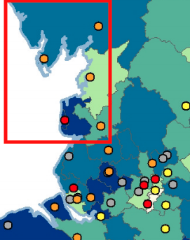

# Track&Know Pilot 2 Synthetic Data Generator

## Input Data

To use the generator public data is required. The sources of each piece of public data is available in the notebook and below. All data needs to be unzipped and placed in this, the input folder. This code does not redistribute the input data as we do not hold the copyright.

### Postcode Data

To generate a synthetic pool of patients we play 'postcode lottery'. Using the publicly available dataset of postcodes and geographic coordinates the code considers ony those postcodes within the specified geographic area of interest and selects at random values from this list. Selection of a postcode does not remove it from the pool i.e. you can have multiple patients from the same. This creates the 'population using the service'.

The postcodes can be found here: https://www.freemaptools.com/download-uk-postcode-lat-lng.htm

### GP Data

Every patients journey through the service starts with an appointment with their General Practitioner. The code considers those GP's in the catchment area and then assigns a GP to member of the population (from the previous step) by identifying the closest GP.

The national list of GP's in England can be found here: https://digital.nhs.uk/services/organisation-data-service/data-downloads/gp-and-gp-practice-related-data

### Facility Information

This data set is a synthetic dataset of patients for an imaginary Obstructive Sleep Apnea service. Using the British Lung Foundations data and propensity maps, we identify facilities that exist in our area of interest. This is a manual process and would need to be adjusted if the area of interest changes. The map can be found here https://www.blf.org.uk/sites/default/files/BLF_OSA_Map_A4_UK_Overall_Weighted_Clinics_0.pdf

To replicate the observed behaviour in Track&Know's Pilot 2, we are assigning a primary centre and a set of outreach clinics. As it happens, for the bundled synthetic data, the BLF data highlights that this area of interest has 1 major centre and 4 minor centres.

 
